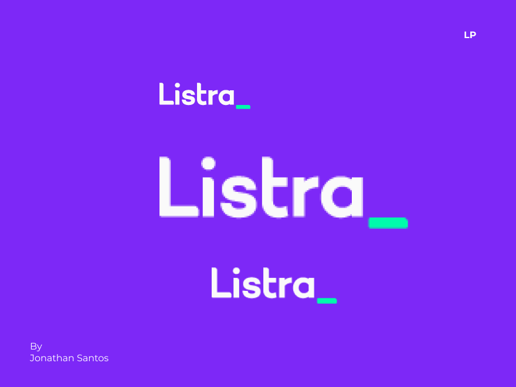
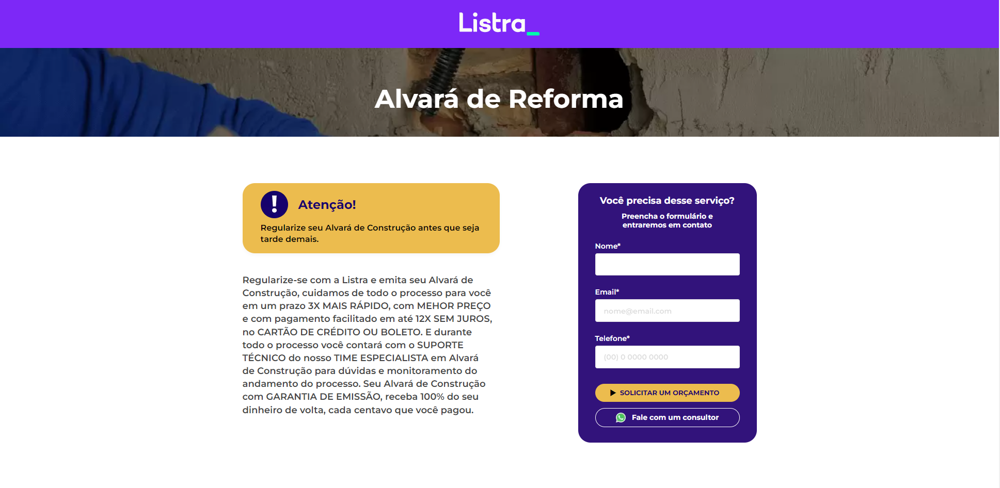
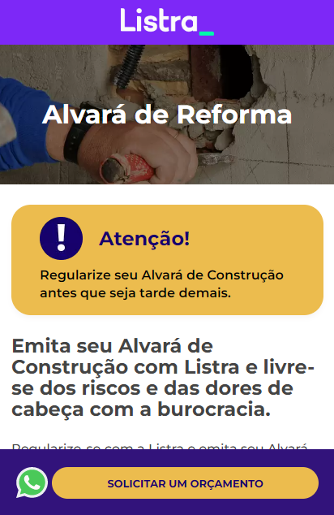

<h1 align="center">
    
</h1>

<h4 align="center"> 
	Projeto Listra LP | 🚀 Em Desenvolvimento!
</h4>

 <a href="#-sobre-o-projeto">Sobre</a> •
 <a href="#user-content-️-implementacao">Implementação e Funcionalidades</a> •
 <a href="#-layout">Layout</a> • 
 <a href="#-como-executar-o-projeto">Como executar</a> • 
 <a href="#user-content-️-tecnologias">Tecnologias</a> • 
 <a href="#-dev">Dev</a> • 
 <a href="#user-content--licença">Licença</a>

## 💻 Sobre o projeto

Link deploy: http://produz.digital/listra_lp/

🚀 Este teste possui como objetivo a criação de um tema do zero no wordpress. Seguindo design feito no figma.

---

## ⚙️ Implementação e Funcionalidades

- [x] Desenvolvimento de um tema do zero  dentro do wordpress;
- [x] Pelo menos uma sessão do protótipo deve ter a possibilidade de alterar o conteúdo dinamicamente dentro do CMS do Wordpress;
- [x] Quando clicar no link do whatsapp “Fale com um consultor” , deve abrir o link https://api.whatsapp.com/send?phone=5531999999999 ;
- [x] Widget do zero para Elementor | Foi feito um plugin e adicionado um widget com as seguintes possibilidades: inverter lado do conteúdo, alterar título, alterar conteúdo texto, alterar imagem, alterar cor de fundo, alterar cor do texto e integração com outras funcionalidades avançadas do Elementor.
- [x] Também foi utilizado o plugin ACF deixando parte do restante do conteúdo editável. E exemplo no painel de como seria essa edição total do site via ACF.
- [x] Possível alterar logo uma única vez nas opções do tema, a mesma será atualizada no header e no footer ao mesmo tempo após salvar.
- [x] Possível escolher o conteúdo texto, icone e link do botão cta para o whatsapp. Este aparece pelo menos 4 vezes no site, sendo uma delas dentro do form.
- [x] Modal na versão mobile. Para acesso ao form.
- [x] Botão flutuante na parte inferior da tela. Versão mobile.
- [x] Slider na seção de testemunhos. Com autoplay ativo.
- [x] Slider na seção de Benefícos. Somente quando tela for referente ao mobile.
- [x] Texto secundário para o título. Aparece somente em dispositivos móveis.
- [x] FAQ list (accordion) com conteúdo dinâmico. (100% editável pelo usuário e sem limite de itens)
- [x] Custom POST Type para Testemunhos (apenas exemplo no wp admin)
- [ ] Exemplos no Opções do tema (painel wp) e na dentro da página LP (em editar página).
- [ ] Otimização geral (em andamento...)
- [ ] CI / CD
- [ ] Outros...

---

## 🎨 Layout

O layout da aplicação:

### Web

    

### Mobile

    

 
  
 <b>Jonathan Santos (Jonathan PD)</b></a>
  

 

---

## 📝 Licença

Este projeto esta sobe a licença [MIT](./LICENSE).

Feito com ❤️ por Jonathan PD 👋🏽 [Entre em contato!](https://www.linkedin.com/in/jonathanpd/)

---

##  Versões do README

[Português 🇧🇷](./README.md)  |  No English version, sorry.
